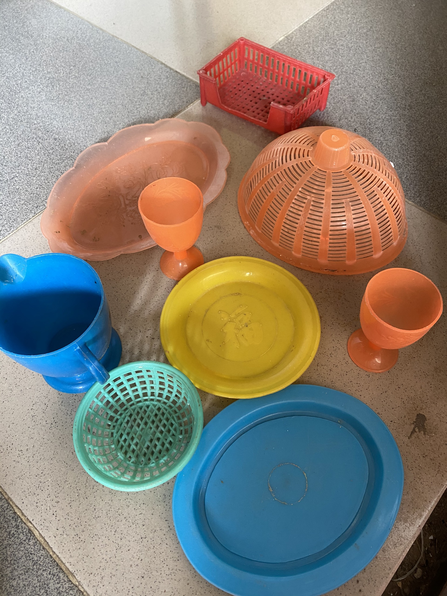

Nay dọn kho lại lôi ra đc đống này. Kỷ niệm lúc còn chút xíu lại hiện về. Nhớ lúc nhỏ, khoảng 2-3 ngày là đòi mẹ ra chợ mua đồ hàng về cho mình chơi. Mới mua về sẽ được mình trưng dụng để ăn cơm. Cứ thế chẳng mấy chốc mình có cả 1 bao tải đồ hàng nào là chén, đũa, muỗng, nồi, bếp, đĩa, lồng bàn... có đủ hết. Mẹ chẳng bao giờ cho mình đem qua nhà hàng xóm chơi vì sợ mình lại làm mất. Thế nhưng tuổi nhỏ nghịch ngợm nào có nghe lời. Cứ trông buổi chiều mẹ đi làm là lại xách cả bao tải qua nhà hàng xóm chơi, giả làm mẹ con, chị em, vợ chồng các kiểu.

Rồi mỗi lần bà Nội mình ra Hội An thì bao giờ cũng nũng nịu đòi bà mua mấy bộ đồ đất cho. Mình lúc nào cũng nũng nịu và bà lúc nào cũng chiều mình. Lần vào về cũng tay xách nách mang lỉnh kỉnh đủ thứ đồ cho mình.

Bà là người cưng chiều mình nhất, chiều những lúc mình bướng bỉnh, những lúc mình trẻ con, những lúc mình làm nũng, những lúc mình khóc nhè. Mỗi lần mình chơi với lũ bạn thì bà luôn ngồi cạnh nhìn mình với nụ cười dõi theo. Bà là người giữ nhiều bí mật của mình nhất, những bí mật mà mình không nói đc với ai.

Nhìn đống này ký ức ùa về. Vui có, buồn có, lại thêm nhớ bà da diết.

Xin 1 vé về tuổi thơ. Nhớ lắm 

<!--EndFragment-->